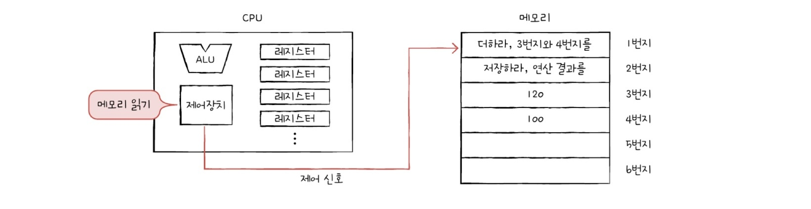
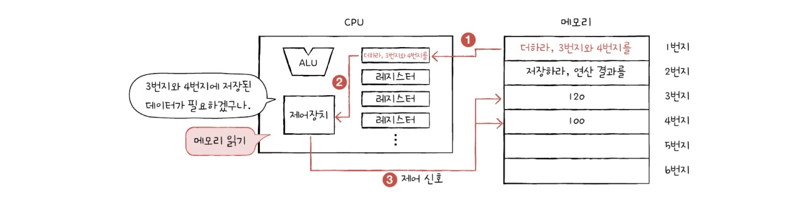
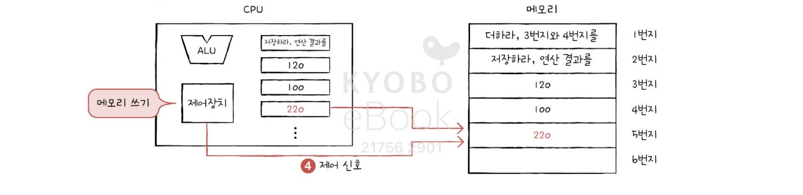
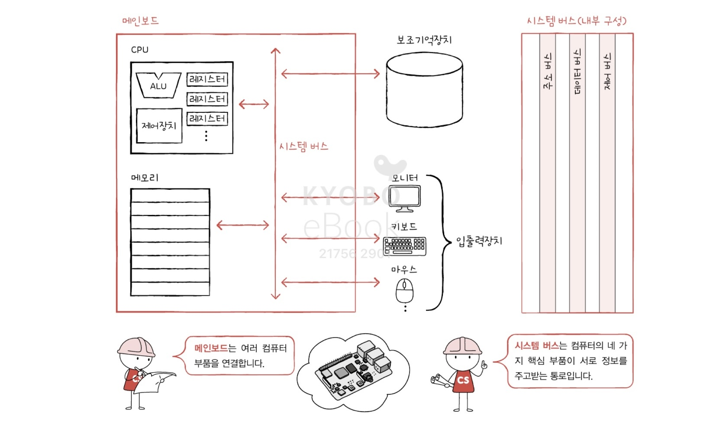
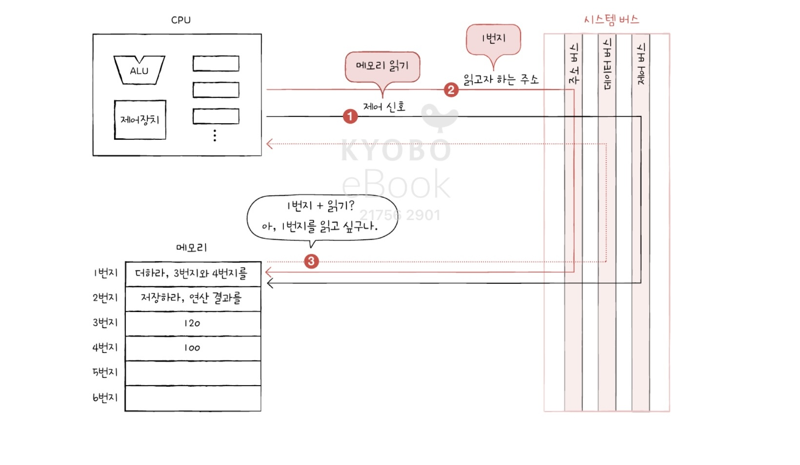

# 01-1 컴퓨터 구조를 알아야 하는 이유
- 개발할 때는 문제 없이 작동했던 코드가 실제 사용자들에게 선보이는 자리에서는 작동하지 않는 상황이 비일비재
    - 코드상의 문법적인 오류만이 원인은 아닐 것.
- 컴퓨터 구조를 이해하고 있다면 문제 상황을 빠르게 진단할 수 있고, 문제 해결의 실마리를 다양하게 찾을 수 있다. 
- 이런 역량이 업무 수행에 필요하기에 각종 기술 면접에서 컴퓨터 구조에 관한 소양을 검증하거나 알아야 하는 분야로 명시

### 성능, 용량, 비용
- 웹사이트를 개발했다고 가정하고, 사용자들에게 선보이려면 이를 실행할 서버 컴퓨터가 필요.
- 서버 컴퓨터마다 비용, 저장 용량도 천차만별
- 단순한 기준은 개인 컴퓨터를 고를 땐 문제가 되지 않으나, 프로그램을 실행할 서버 컴퓨터를 고를 땐 문제가 된다.
    - ex) 서버 컴퓨터의 성능이 떨어져서 링크를 누를 때마다 몇 초씩 기다려야한다면 아무도 그 웹사이트를 이용하지 않을 것
- 어떤 CPU를 사용할지, 어떤 메모리를 사용할지 등을 직접 판단하고 현명하게 선택해야 한다. 
    - 개발한 프로그램이 어떤 환경에서 어떻게 작동하는지는 개발자가 가장 잘 이해하고 있어야 하고, 프로그램을 위한 최적의 컴퓨터 환경을 스스로 판단할 수 있어야 한다. 
    - **성능, 용량, 비용** 문제는 프로그래밍 언어의 문법만 알아서는 해결하기 어렵다.
    - ex) 유튜브, 워드 프로세서, 포토샵 같이 사용자가 많은 프로그램은 필연적으로 성능, 용량, 비용이 고려된다.
- 컴퓨터 구조를 이해하면 입력과 출력에만 집중하는 개발을 넘어 **성능, 용량, 비용**까지 고려하며 개발하는 개발자가 될 수 있다.
> 컴퓨터 구조를 이해하면,
> 1. **문제 해결** 능력이 향상
> 2. 문법만으로 알기 어려운 **성능/용량/비용**을 고려하며 개발 가능
> 3. 컴퓨터를 미지의 대상에서 **분석의 대상**으로 인식

&nbsp;
# 01-2 컴퓨터 구조의 큰 그림
> 데이터, 명령어, 메모리, CPU, 보조기억장치, 입출력장치, 시스템버스

알아야 할 컴퓨터 구조
1. 컴퓨터가 이해하는 정보
2. 컴퓨터의 네가지 핵심 부품

### 컴퓨터가 이해하는 정보
- 컴퓨터는 0과 1로 표현된 정보만 이해
- 0과 1로 표현된 정보는 크게 데이터와 명령어로 나뉜다.
- **데이터**
    - 컴퓨터가 이해하는 숫자, 문자, 이미지, 동영상과 같은 정적인 정보를 가리킴.
- **명령어**
    - 데이터를 움직이고 컴퓨터를 작동시키는 정보
    - 데이터는 명령어 없이는 아무것도 할 수 없는 정보 덩어리  

&rarr; 명령어는 컴퓨터를 작동 시키는 정보. 데이터는 명령어를 위해 존재하는 일종의 재료.
- 컴퓨터 프로그램은 '명령어들의 모음'으로 정의되기도 한다.

&nbsp;
----

### 컴퓨터의 4가지 핵심 부품
> 중앙처리장치 Central Processing Unit CPU  
> 주기억장치 main memory 메모리 &rarr; **RAM**/ROM  
> 보조기억장치 secondary storage  
> 입출력장치 input/output(I/O) device  

### 메모리
- 현재 실행되는 프로그램의 명령어와 데이터를 저장하는 부품
- 프로그램이 실행되려면 반드시 메모리에 저장되어 있어야 한다. 
- 메모리에 저장된 값의 위치는 주소로 확인 가능

### CPU
- 컴퓨터의 두뇌
- 메모리에 저장된 명령어를 읽어 들이고, 읽은 명령어를 해석하고 실행하는 부품
- CPU의 내부 구성 요소 중 가장 중요한 3가지
    1. **산술논리연산장치** ALU: Arithmetic Logic Unit        - 계산기
    2. **레지스터** register - 임시 저장 장치
        - 프로그램을 실행하는데 필요한 값들을 임시로 저장
        - 여러 개의 레지스터가 존재, 각기 다른 이름과 역할 
    3. **제어장치** CU: Control Unit - 제어 신호 발생 명령어 해석 장치
        - 제어 신호는 컴퓨터의 부품들을 관리하고 작동시키는 일종의 전기 신호  

- CPU 작동 과정
    1. 제어장치가 1번지에 저장된 명령어를 읽어 들이기 위해 메모리에 '메모리 읽기' 제어 신호를 보낸다. 
    
    2. 메모리는 1번지에 저장된 명령어를 CPU에게 건데고, 이 명령어는 레지스터에 저장  
    제어장치는 읽어들인 명령어 해석 후 3, 4번지의 데이터가 필요하다고 판단  
    '메모리 읽기' 제어신호 보냄
    
    3. 메모리는 3, 4번지에 저장된 데이터를 CPU에 건네주고, 이 데이터들은 서로 다른 레지스터에 저장된다.  
    ALU가 저장된 데이터를 연산하고 그 값이 레지스터에 저장된다.
    
    4. 제어장치가 2번지에 ... '메모리 읽기' 제어 신호 보냄
    
    
    제어장치가 계산 결과 저장을 위해 메모리에 '메모리 쓰기' 제어 신호와 계산 결과를 보냄
    

### 보조기억장치
- 메모리의 치명적인 약점을 보완
    1. 가격이 비싸고 용량이 작다
    2. 전원이 꺼지면 저장된 내용을 잃는다. 
- 메모리보다 크기가 크고 전원이 꺼져도 저장된 내용을 잃지 않는 메모리 보조 장치
- 보조기억장치의 일종
    - 하드 디스크, SSD, USB 메모리, DVD, CD-ROM
- 메모리가 현재 '실행되는' 프로그램을 저장한다면,  
보조기억장치는 '보관할' 프로그램을 저장

### 입출력장치
- 컴퓨터 외부와 연결되어 컴퓨터 내부와 정보를 교환하는 장치
    - 마이크, 스피커, 프린터, 마우스, 키보드
- '보조기억장치'와 '입출력장치'를 컴퓨터 주변에 붙어있는 장치라는 의미로 '주변장치'라 통칭하기도 함. &rarr; 보통 둘을 구분함.
    - but, 보조기억장치는 메모리를 보조한다는 특별한 기능 수행하는 장치

### 메인보드와 시스템 버스

- 메인보드 == 마더보드
    - 컴퓨터의 핵심 부품들과 여러 컴퓨터 부품이 모두 연결된 판
- 버스
    - 버스라는 통로로 메인보드와 연결된 부품들은 서로 정보를 주고 받음.
    - **시스템 버스**: 여러 버스 가운데, 컴퓨터의 4가지 핵심 부품을 연결하는 가장 중요한 버스 
- 시스템 버스
    1. 주소 버스 - 주소를 주고받는 통로
    2. 데이터 버스 - 명령어와 데이터를 주고받는 통로
    3. 제어 버스 - 제어신호를 주고받는 통로  
    ex)  
    제어 버스는 '메모리 읽기' 제어 신호 내보냄  
    주소 버스는 읽고자 하는 주소 내보냄  
    메모리는 데이터 버스로 CPU가 요청한 주소에 있는 내용을 보냄
    