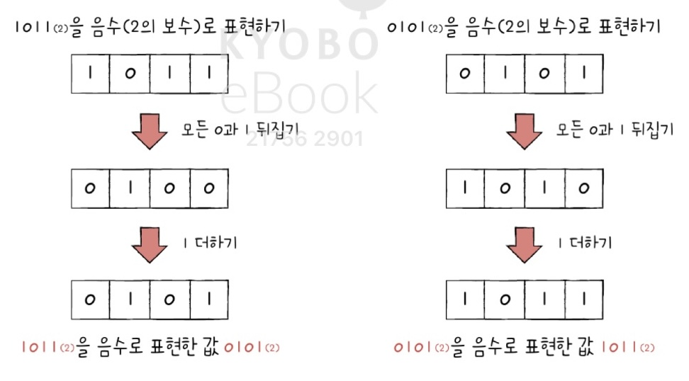
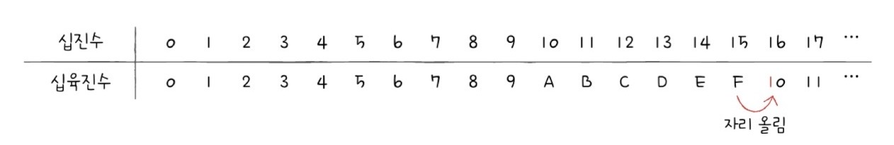
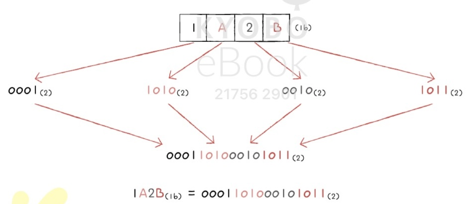
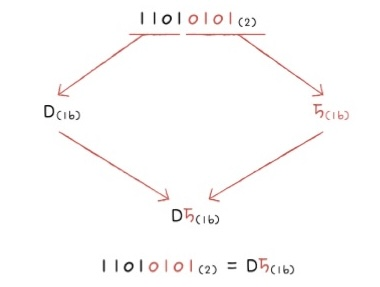

# 02-1 0과 1로 숫자를 표현하는 방법
> 비트, 바이트, 이진법, 2의 보수, 십육진법
### 정보 단위
- 0과 1을 나타내는 가장 작은 정보 단위 &rarr; **비트(bit)**  
    - 0  &rarr; 꺼짐 ▢ / 1  &rarr; 켜짐 ■
    - n비트는 $2^n$ 가지 정보 표현 가능
- 여덟 개의 비트를 묶은 단위 &rarr; **바이트(byte)**  
- 킬로바이트(kB) &rarr; 메가바이트(MB) &rarr; 기가바이트(GB) &rarr; 테라바이트(TB) &rarr; ...

| 단위  &rarr; | 이전 단위 |
| --- | --- |
| 1 바이트 | **8 비트 (예외)** |
| 1 킬로바이트 | 1,000 바이트 |
| 1 메가바이트 | 1,000 킬로바이트 |
| 1 기가바이트 | 1,000 메가바이트 | 
| ... | ... |

- 바이트를 제외한 kB, MB, GB, 등의 단위들은 모두 이전 단위를 **1,000개** 묶어 표현한 단위
- 이전 단위를 1,024개 묶어 표현한 단위는 ***KiB, MiB, GiB, TiB*** 이다.   

> 워드(word)란,
> - CPU가 한 번에 처리할 수 있는 데이터의 크기를 의미
> - 만약 CPU가 한 번에 16비트를 처리할 수 있다면 1워드는 16비트가 되고,  
> 한 번에 32비트를 처리할 수 있다면 1워드는 32비트가 됨
>   - 워드의 절반 크기 &rarr; 하프 워드 half word
>   - 워드의 1배 크기 &rarr; 풀 워드 full word
>   - 워드의 2배 크기 &rarr; 더블 워드 double word
> - 때문에, 워드 크기가 큰 CPU는 한 번에 처리할 수 있는 데이터가 많음
> - 현대 컴퓨터의 워드 크기는 대부분 32비트 또는 64비트

### 이진법 binary
- 수학에서 0과 1만으로 모든 숫자를 표현하는 방법
- 이진법으로 표현한 수 &rarr; 이진수
- 십진수와 이진수 혼동 예방을 위해 &rarr; 이진수$_{(2)}$(수학상), $0b$이진수(코드상) 사용

### 이진수의 음수 표현
> 십진수의 음수 표현 &rarr; 단순히 숫자 앞에 마이너스 부호를 붙힘
- **2의 보수** 를 구해 이 값을 음수로 간주
    - (사전적 의미) 어떤 수를 큰 $2^n$에서 뺀 값
    - (ex) $11_{(2)}$ 의 2의 보수는 $11_{(2)}$보다 큰 $2^n$ ($100_{(2)}$)에서 $11_{(2)}$을 뺀 $01_{(2)}$이 되는 것  
     &rarr; $100_{(2)}$과 $11_{(2)}$의 차이는 $01_{(2)}$
    - (ex) 모든 0과 1을 뒤집고, 거기에 1을 더한 값
    
- 플래그(flag) &rarr; 이진수를 음수인지 양수인지 구분하기 위해 컴퓨터 내부에서 사용하는 **부가 정보** 
- 2의 보수는 완벽한 방식은 아니다. 0이나 $2^n$의 형태의 이진수에 2의 보수를 취하면 원하는 음수 값을 얻을 수 없다. 
    - (ex) 0 (0000 &rarr; 10000), $2^3$ (1000 &rarr; 1000)

### 십육진법 hexadecimal 

- 15를 넘어가는 시점에 자리 올림을 함

- 십진수를 사용안하고 이진법을 사용하는 이유
    1. 이진법의 단점을 보완하기 위해 사용
        - 이진법의 단점: 0과 1만으로 모든 숫자를 표현 &rarr; 숫자의 길이가 너무 길어짐
    2. 이진수에서 십육진수로. 또, 그 반대로 변환하기 쉽기에 사용
- 한글자로 열여섯 종류의 정보를 표현 (0~9, A~F)
- 십육진수$_{(16)}$(수학상), $0x$십육진수(코드상) 사용

### 변환하기 (십육진수 &rarr; 이진수 / 이진수 &rarr; 십육진수)
- 십육진수 숫자하나를 이진수로 표현 => 4비트 필요 ($2^n$ = 16)

- 이진수 숫자를 네 개씩 끊고, 끊은 네 개의 숫자를 하나의 십육진수로 변환

> 하드웨어와 밀접하게 맞닿아 있는 개발 분야에서는 코드에 십육진수를 직접 쓰는 경우도 더러 있다. 
